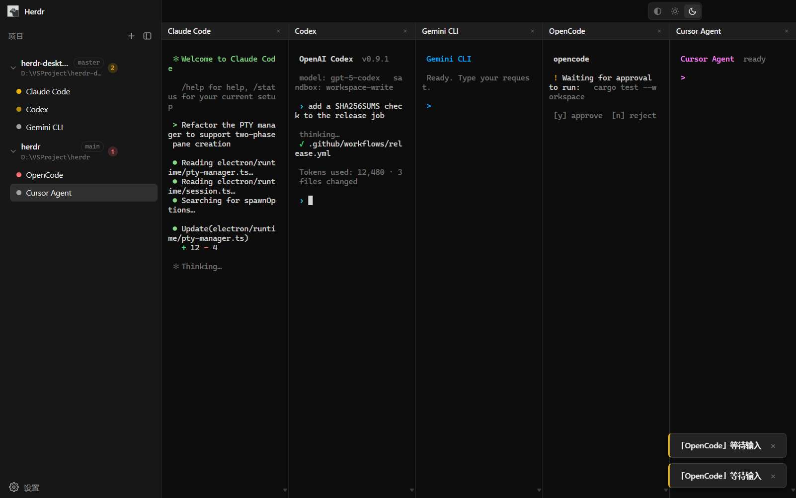

# Herdr Desktop

> 多 agent 管理桌面端应用 —— 让你的 AI coding agent 常驻运行的运行时。

[English](README.en.md) | **简体中文**

[](LICENSE)
[](https://github.com/zdfdonny/herdr-desktop/actions/workflows/release.yml)
[](https://www.electronjs.org/)
[](#下载)

---

## 截图



左侧是项目与 agent 列表（带分支徽标与状态点），右侧并排显示多个 agent 的终端。
图中 5 个 agent 同时运行，状态分别为工作中 / 已完成 / 空闲 / 等待输入，
右下角是 agent 状态变化时弹出的应用内提示。

---

## 这是什么

Herdr Desktop 把「终端里同时跑好几个 AI coding agent」这件事，从一堆手忙脚乱的
终端窗口变成一个真正的桌面应用：左侧是项目与 agent 列表，右侧并排显示每个 agent
的终端，状态一目了然。

它参考了 [herdr](https://github.com/herdrdev/herdr)（Rust 写的终端多 agent 运行时）
的设计。herdr 本身**是一个纯终端 TUI 程序**，官方并不带桌面端；本项目是作者在
herdr 之外另起炉灶做的桌面端，自己实现 Agent 运行时后端，把 agent 状态、布局、
会话管理变成第一等的 GUI 数据，而不是终端里的字符画。

### 和「把 herdr 塞进终端」的区别

要给 herdr 配一个图形界面，最直接的做法是做一个**纯终端透传壳**：Electron 主进程用
`node-pty` 把 `herdr.exe` 当子进程跑起来，把整个 TUI 当作普通终端透传给一个
xterm.js——窗口里显示的仍然是 herdr 的字符画界面。

Herdr Desktop 不走这条捷径：它**不依赖 herdr 二进制**，而是自持 PTY 生命周期、
状态检测与持久化，直接管理各个 agent 进程本身。

| | 终端透传壳 | Herdr Desktop |
|---|---|---|
| 运行的是什么 | herdr TUI | 各 agent 进程本身 |
| 界面来源 | herdr 的字符画 | 原生 React 组件 |
| agent 状态 | 解析屏幕内容 | 运行时后端直接产出结构化状态 |
| 依赖 | 需要 herdr 二进制 | 不需要 |

---

## 功能

### 终端

- **xterm.js 6 + WebGL 渲染**，高频输出下依然流畅
- **node-pty**：Windows 走 ConPTY，macOS / Linux 走 forkpty
- **两阶段 pane 创建**：先建 pane → 终端挂载并 fit → 用精确 `cols/rows` 启动 PTY。
  彻底解决 opencode 等 TUI 应用首帧排版错位
- **终端背景随主题**（VSCode `terminal.background` 风格），切换主题时重建 WebGL addon
- **字号可调**（9–24px），滚动缓冲搜索

### Agent 管理

- **项目 → Agent 两级模型**：先添加项目目录，再在项目内创建 agent
- **24 个内置 agent 预设**：Claude Code、Codex、Gemini CLI、Cursor Agent、
  OpenCode、GitHub Copilot CLI、Qwen Code、Kimi、Kiro、Droid、Amp、Grok、
  Cline、MastraCode、Letta、Muse……外加一个普通终端
- **可用性探测**：创建时按 PATH 实际解析结果过滤掉没装的 agent，
  只显示本机真正能用的
- **状态徽标**：idle / working / blocked / done
- **状态变化通知**：转到 blocked / done 时弹 toast；blocked 且窗口未聚焦时
  额外发系统通知
- **多 pane 并排**：水平分屏，每个 pane 独立 xterm 实例互不串扰

### 会话与恢复

- **原子持久化**：串行写链 + 唯一临时文件名 + rename，并发写不冲突
- **重开恢复**：启动时恢复项目 / pane / agent 结构，但不自动拉起进程；
  点击 agent 行时才按需启动（避免开机瞬间拉起一堆进程）
- **恢复失败保留结构**：命令被卸载等情况保留 pane 条目，再次点击即可重试

### 界面

- **风格左右分栏**，自定义标题栏（保留原生窗口按钮）
- **浅色 / 深色 / 跟随系统** 主题
- **中英文界面**，中文默认

---

## 下载

前往 [Releases](../../releases) 下载对应平台安装包：

| 平台 | 架构 | 文件 |
|------|------|------|
| Windows | x64 | `Herdr Desktop-*-win-x64-setup.exe` |
| Windows | arm64 | `Herdr Desktop-*-win-arm64-setup.exe` |
| macOS | Intel | `Herdr Desktop-*-mac-x64.dmg` |
| macOS | Apple Silicon | `Herdr Desktop-*-mac-arm64.dmg` |
| Linux | x64 | `Herdr Desktop-*-linux-x64.AppImage` / `.deb` |
| Linux | arm64 | `Herdr Desktop-*-linux-arm64.AppImage` / `.deb` |

Windows 与 macOS 额外提供 `.zip` 免安装版。每个 Release 附 `SHA256SUMS.txt` 校验和。

> **macOS 用户注意**：应用**未做代码签名与公证**，首次打开请右键 →「打开」，
> 或执行：
>
> ```bash
> xattr -cr "/Applications/Herdr Desktop.app"
> ```
>
> **Linux 用户注意**：AppImage 需要先赋予执行权限：
>
> ```bash
> chmod +x "Herdr Desktop-*-linux-x64.AppImage"
> ```

---

## 快速开始

### 环境要求

- **Node.js 20+**
- Windows / macOS / Linux

### 从源码运行

```bash
git clone https://github.com/zdfdonny/herdr-desktop.git
cd herdr-desktop
npm install
npm run dev
```

### 常用命令

| 命令 | 说明 |
|------|------|
| `npm run dev` | 开发模式（热重载） |
| `npm run build` | 构建到 `dist/` 与 `dist-electron/` |
| `npm run typecheck` | TypeScript 类型检查 |
| `npm run test:unix` | Unix 平台解析逻辑单元测试 |
| `npm run icon` | 重新生成应用图标 |
| `npm run dist:win` | 打 Windows 安装包 |
| `npm run dist:mac` | 打 macOS 安装包 |
| `npm run dist:linux` | 打 Linux 安装包 |

需要指定架构时用 `dist:win:x64` / `dist:win:arm64` / `dist:mac:x64` /
`dist:mac:arm64` / `dist:linux:x64` / `dist:linux:arm64`。

### 使用流程

1. 点击左侧 **添加项目**，选一个本地代码目录
2. 在项目下点击 **+**，从列表里选一个 agent（只会显示本机已安装的）
3. agent 启动后，右侧即可看到它的终端；侧栏状态点会随 agent 状态变化
4. 关闭窗口不会中断 agent —— 重新打开后点击该 agent 即可回到会话

---

## 架构

```
┌─────────────────────────────────────────────────────┐
│                   Main 进程（Node）                  │
│  Agent 运行时后端：PTY 生命周期 / 状态检测 / 持久化   │
└───────────────────────┬─────────────────────────────┘
                        │  版本化 IPC 契约
                        │  { type, version, payload }
                        │  双通道：pty:data（高频）
                        │          state（结构变更）
┌───────────────────────┴─────────────────────────────┐
│                 Renderer 进程（React）               │
│  项目/agent 列表 · 状态徽标 · 分屏布局 · xterm.js     │
└─────────────────────────────────────────────────────┘
```

### 核心设计原则

- **State 与 Runtime 分离**：`shared/state.ts` 是纯数据、可序列化；
  `PtyRuntime` 只存在于 Main 进程，永不序列化
- **单向数据流**：Renderer 的 store 是 Main 端状态的投影，无本地权威状态
- **版本化冻结契约**：统一 envelope，破坏性变更必须 bump version
- **双通道分离**：高频终端数据与低频结构状态互不干扰
- **平台代码隔离**：平台差异全部收敛在 `electron/platform/`，
  核心模块零平台判断

### 目录结构

```
herdr-desktop/
├── electron/              # Main 进程
│   ├── runtime/           #   PTY 管理 / 状态检测 / 会话 / 持久化
│   ├── ipc/               #   IPC 契约与路由
│   └── platform/          #   平台层（win / unix / darwin / linux）
├── src/                   # Renderer 进程（React）
│   ├── components/        #   扁平组件
│   ├── stores/            #   Zustand
│   └── xterm/             #   xterm.js 封装
├── shared/                # 三端共享类型
├── scripts/               # 图标生成 / 验证 / 测试
└── docs/                  # 架构与状态文档
```

更详细的设计说明见 [`docs/architecture.md`](docs/architecture.md)，
功能实现进度见 [`docs/status.md`](docs/status.md)。

### 平台差异

平台差异全部收敛在 `electron/platform/`，按 `process.platform` 分发：

| 维度 | Windows | macOS / Linux |
|------|---------|---------------|
| 命令解析 | PATH × PATHEXT 补齐扩展名 | PATH 顺序查找，以**可执行位**为准 |
| 启动包装 | `.cmd`/`.bat` 需 `cmd.exe /d /c` 包装 | 无此概念 |
| 启动环境 | 直接继承 | 跑 `shell -l -i -c env` 捞登录环境 |
| 终端后端 | ConPTY | forkpty |
| 终端快捷键 | `Ctrl+Shift+C/V`、`Ctrl+F` | `⌘C` / `⌘V` / `⌘F` |

> GUI 应用从 Finder / `.desktop` 启动时**不继承**用户 shell 的 PATH，
> 所以 macOS / Linux 必须主动捞取登录环境，否则会把已安装的 agent 误判为「未安装」。

---

## 参与贡献

欢迎提交 Issue 与 Pull Request。

```bash
git checkout -b feature/your-feature
# 改代码
npm run typecheck && npm run test:unix
git commit -m "feat: ..."
git push origin feature/your-feature
```

提交前请确保 `npm run typecheck` 通过——项目开启了 TypeScript strict
（含 `noUnusedLocals` / `noUnusedParameters`）。

---

## 打包与发布

发布走 GitHub Actions，**手动触发**：

`Actions` → `Build & Release` → `Run workflow`

- 版本号默认读 `package.json` 的 `version`，也可以手动填 tag 覆盖
- 自动构建 **3 平台 × 2 架构 = 6 个安装包**，并发布到 Release
- 可选择发布为草稿（draft）以便先检查产物

> **已知限制**：macOS 与 Linux 的代码路径已完成，但**尚未在真机验证**。
> 详见 [`docs/status.md`](docs/status.md)。

---

## 致谢

- [herdr](https://github.com/herdrdev/herdr) —— 设计灵感来源
- [xterm.js](https://xtermjs.org/) / [node-pty](https://github.com/microsoft/node-pty)
- [Electron](https://www.electronjs.org/) / [React](https://react.dev/) / [Zustand](https://zustand-demo.pmnd.rs/)

## 开源协议

[MIT](LICENSE)
